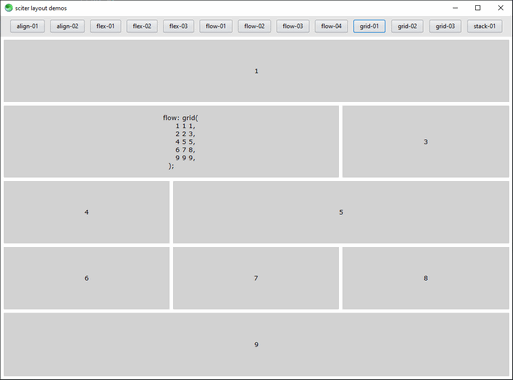

# sciter layouts

This is a [sciter.js](https://sciter.com/) demo that explores the different layout possibilities in sciter.



## requirements

- A recent version of Node.js `node` (tested with 16 LTS) and its package manager `npm`.
    - On Windows [download](https://nodejs.dev/download/) and run the installer
    - On Linux check the [installation guide](https://www.digitalocean.com/community/tutorials/how-to-install-node-js-on-ubuntu-20-04#option-2-%E2%80%94-installing-node-js-with-apt-using-a-nodesource-ppa)

## demo

- git clone the repository
- install packages `npm install`
- install latest sciter sdk `npm run install-sdk`
- start the demo `npm run scapp`

## layout

sciter layout concepts are introduced in this article:

[https://terrainformatica.com/w3/flex-layout/flex-vs-flexbox.htm](https://terrainformatica.com/w3/flex-layout/flex-vs-flexbox.htm)

### flow

`flow` is the sciter analog to `display:flex`. Possible values are:

- `horizontal` contained elements are on a horizontal line
- `vertical` contained elements are on a vertical line
- `horizontal-wrap` same as above with wrapping to the next line when the line is too long
- `row(item1, item2, ...)` items are on a horizontal line
- `grid` custom layout
- `stack` elements are on top of each other
- `table`, `table-fixed` ? add an example

### flex length units

Flex length units are "weights" used in distribution of free space along some direction.

[https://sciter.com/css-extensions-in-h-smile-engine-part-ii-flex-units/](https://sciter.com/css-extensions-in-h-smile-engine-part-ii-flex-units/)

#### %%

```css
width: 50%;
margin-left: 30%%;
margin-right: 70%%;
```

#### *

1* == 100%%

```css
width: 50%;
margin-left: 1*;
margin-right: 2*;
```
